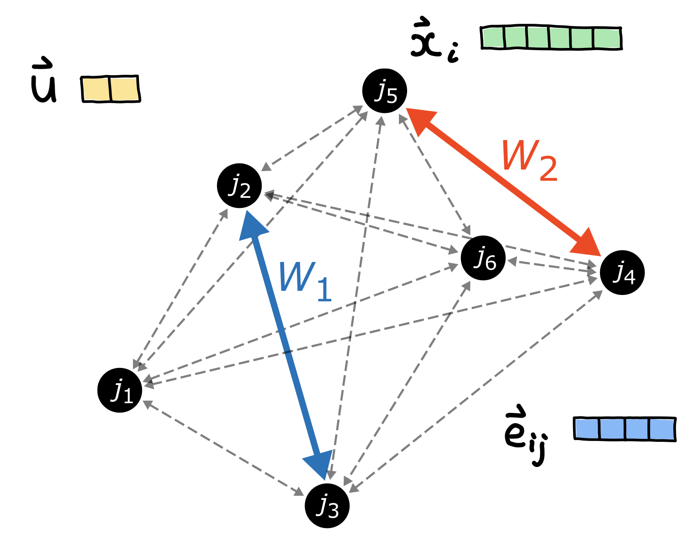
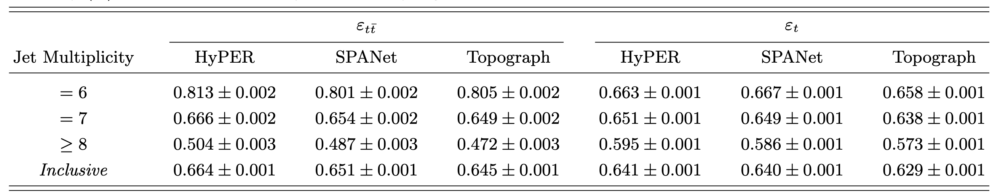
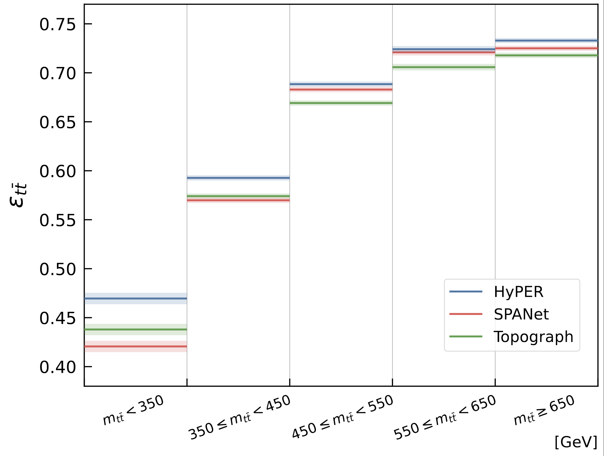

## Reconstruction of $t\bar{t}$ Events with All-Hadronic Final States

  

This study is publised in _"Reconstruction of Short-Lived Particles using
Graph-Hypergraph Representation Learning"_ .

### Motivation 

Reconstructing short-lived particles from their hadronic decay products in
collider experiments is challenging. 
The corrct combination of final-state objects must be associated with each short-lived particle, and additional final-state
jets can be produced from QCD radiation or pile-up effects.
`HyPER` uses _blended graph-hypergraph representation learning_ to identify
which final-state objects belong to which short-lived particles.
This work demonstrates the utility of this method by studying the all-hadronic
decay of top-antitop quark pairs.

### Graph-Hypergraph Representation

`HyPER` represents event final states as digraphs, with all final-states
represented as nodes, and additional kinematic information embedded in edge and
global graph features.
It seeks to classify the correct 'edge structure' within the graph that joins
the relevant final-state jets: for $W$ bosons, this is a simple
edge between two nodes; for top quarks, this is a hypderedge between three
nodes.
Any short-lived particle (SM of BSM) which decays into $N$ final-state jets can
be reconstructed using a hyperedge of cardinality $N$.

  
### Reconstruction Strategy

`HyPER` first uses a message-passing neural network to build a latent
representation of the graph, updating the node, edge and global feature vectors
sequentially.

#### W Boson Reconstruction
The updates edge attributes are converted to soft probabilities representing the
likelihood of this edge connecting two true $W$ boson decay products.

#### Top Quark Reconstruction
A set of 3-hyperedges is built by considering every combinationof three nodes in
the graph.
`HyPER` constructs embeddings for each hyperedge. 
These embeddings a processsed by a hyperedge layer which returns a soft
probability that each hyperedge represents a true top quark. 
The hyperedge layer utilises a novel attention-inspired mechanism to weight the
relevant importance of the hyperedge features.

### Dataset

Training, validation and testing of the model is carried out on MC-simulated
proton-proton collision events at $\sqrt{s} = 13 \mathrm{TeV}$. 
The simulated samples are generated using the `MadGraph`, `Pythia` and `Delphes`
software tools. The dataset and its partitions are available [here](https://zenodo.org/records/10653837).

### Other  

HyPER provides four main outputs: `HyPER_HE_IDX`, `HyPER_HE_RAW`, `HyPER_GE_IDX`
and `HyPER_GE_RAW`.

| Variables | Description |
| ------------- | ------------- |
| `HyPER_HE_IDX` | Indices of the nodes enclosed by a hyperedge  |
| `HyPER_HE_RAW` | Soft probability of a hyperedge |
| `HyPER_GE_IDX` | Indices of the nodes connected by a graph edge |
| `HyPER_GE_RAW` | Soft probability of a graph edge |

### Results

All results are found in our paper. Two results are highlighted here.
This table shows our results compared to two other ML-based reconstruction
techniques, `SPANet` and `Topograph`.

A highlight result is that `HyPER` reconstructs a higher number of $t \bar{t}$ events correctly across the entire invariant mass phase-space of the $t \bar{t}$ system.

