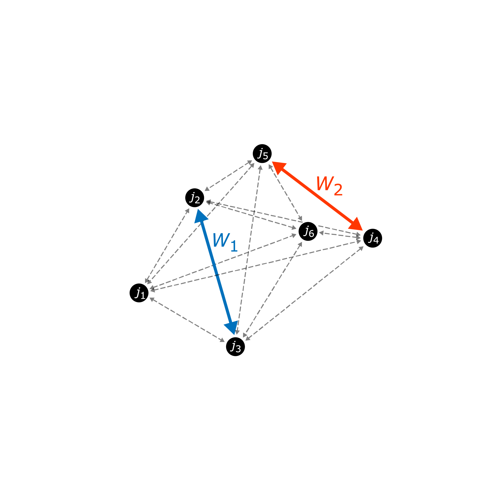
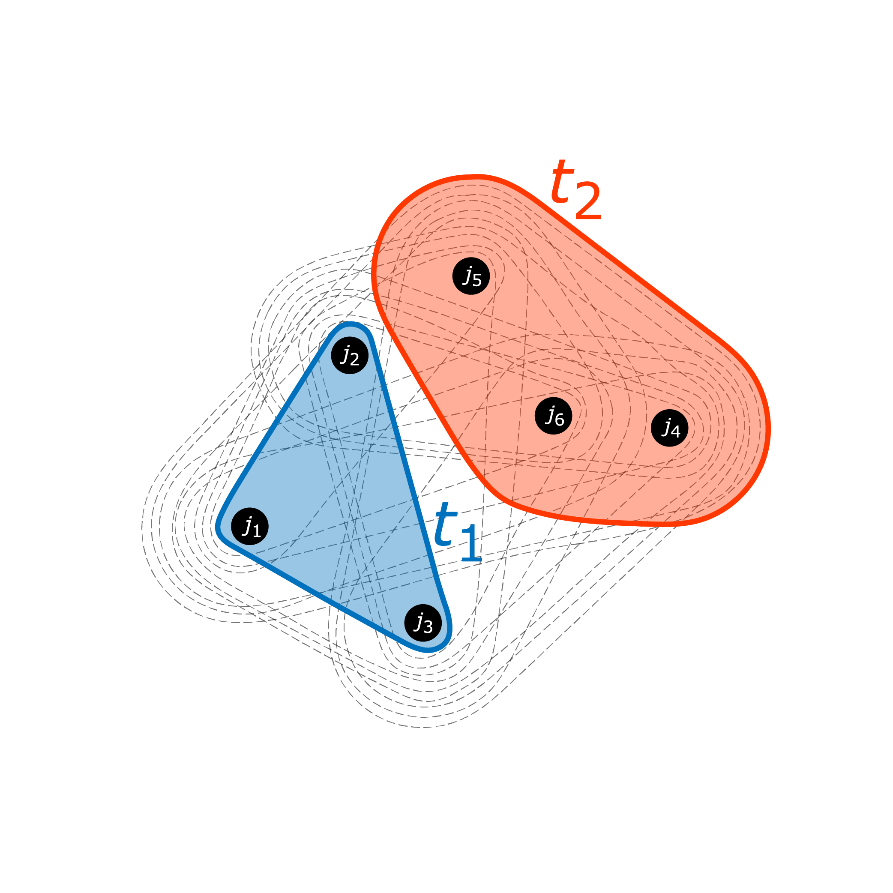

## Reconstruction of $t\bar{t}$ Events with All-Hadronic Final States

  [](https://arxiv.org/abs/2402.10149)

This study is publised in _"Reconstruction of Short-Lived Particles using
Graph-Hypergraph Representation Learning"_ .

### Motivation 
Reconstructing short-lived particles from their hadronic decay products in
collider experiments is challenging. 
The corrct combination of final-state objects must be associated with each short-lived particle, and additional final-state
jets can be produced from QCD radiation or pile-up effects.
`HyPER` uses _blended graph-hypergraph representation learning_ to identify
which final-state objects belong to which short-lived particles.
This work demonstrates the utility of this method by studying the all-hadronic
decay of top-antitop quark pairs.

### Graph-Hypergraph Representation
`HyPER` represents event final states as digraphs, with all final-states
represented as nodes, and additional kinematic information embedded in edge and
global graph features.
It seeks to classify the correct 'edge structure' within the graph that joins
the relevant final-state jets: for $W$ bosons, this is a simple
edge between two nodes; for top quarks, this is a hypderedge between three
nodes.
Any short-lived particle (SM of BSM) which decays into $N$ final-state jets can
be reconstructed using a hyperedge of cardinality $N$.




### Reconstruction Strategy
We provide a reconstruction script for the all hadronic $t\bar{t}$ events: [`reconstruct_ttbar_allhad.py`](reconstruct_ttbar_allhad.py).
Providing the configurations (`-c`), pre-built graph dataset (`--test`), and the log directory of the trained model (`--log_dir`), run
```
python reconstruct_ttbar_allhad.py -c presets/ttbar_allhad.json --log_dir HyPER_log/version_0 --test ttbar_test -o ./reconstructed_test.pkl
```
This will use provided model to evaluate on the graph dataset, and save the results to a `.pkl` file. The reconstruction strategy used in the script can be summarised as following.

#### Top Quark Reconstruction
A set of 3-hyperedges is built by considering every combination of three nodes in the graph.
`HyPER` constructs embeddings for each hyperedge. 
These embeddings a processsed by a hyperedge layer which returns a soft probability that each hyperedge represents a true top quark.
The constituents and probability of each hyperedge is saved as `HyPER_HE_IDX` and `HyPER_HE_RAW`, repectively.
We select two independent, highest scoring hyperedges as two top quark candidates.

#### W Boson Reconstruction
The updates edge attributes from message-passing are converted to soft probabilities representing the likelihood of this edge connecting two true $W$ boson decay products.
Similar to hyperedges, the edge outputs are saved as `HyPER_GE_IDX` and `HyPER_GE_RAW`.
The $W$ boson candidate is selected as the highest scoring graph edge, who is a subset of a selected hyperedge.


### Dataset

Training, validation and testing of the model is carried out on MC-simulated
proton-proton collision events at $\sqrt{s} = 13$ TeV. 
The simulated samples are generated using the `MadGraph`, `Pythia` and `Delphes`
software tools. The dataset and its partitions are available [here](https://zenodo.org/records/10653837).
